# Uso de Codex en pantallas Divoom

[English](README.md) | [Español](README.es.md)

Muestra el uso de Codex, los horarios de recarga, la actividad y los créditos de reset disponibles en una Divoom MiniToo o TimeBox Mini. El monitor consulta la cuenta iniciada mediante Codex App Server local. MiniToo recibe un panel de 160 × 128 píxeles con el correo y el plan de la cuenta en el pie; TimeBox Mini muestra una pantalla compacta para su matriz LED de 11 × 11.

Esta versión funciona en **macOS**. MiniToo incluye seis temas: **neón**, **pixel art**, **anime**, **anime-pixel** (adulta con el estilo de dibujo de chibi), **anime-pixel-chibi** y **anime-pixel-detail** (adulta detallada). TimeBox Mini usa un diseño compacto para su matriz de 11 × 11, con varios colores de acento opcionales. [Ver los temas](#temas-y-colores).

## Requisitos

- Una Divoom MiniToo o TimeBox Mini enlazada con tu Mac
- macOS con Bluetooth activado
- Python 3.10 o posterior
- Xcode Command Line Tools (`swiftc`); si hace falta, instálalos con `xcode-select --install`
- [Codex CLI](https://learn.chatgpt.com/docs/codex/cli) instalado e iniciado con una cuenta ChatGPT que tenga límites de uso de Codex

El monitor se ejecuta en Terminal, que debe permanecer abierta para mantener la pantalla actualizada. No instala un servicio en segundo plano.

## Instalación

Clona este repositorio desde Terminal y ejecuta:

```sh
git clone https://github.com/AFrayde01/divoom-minitoo-codex.git
cd divoom-minitoo-codex
./install
```

El instalador crea un entorno virtual de Python y compila los puentes Bluetooth para ambos modelos Divoom. Después pregunta si quieres instalar los hooks de actividad de Codex en todos los perfiles detectados o elegir uno. Usa **↑ / ↓** y **Enter**, igual que los menús de `./start`. Busca `CODEX_HOME` (o `~/.codex`) y cada perfil en `~/Library/Application Support/Parall/*/.codex`, incluidas las instancias de Codex y ChatGPT. Todos los perfiles instalados comparten el mismo archivo local de actividad, con cada evento identificado por su perfil de origen. Al reinstalar se conservan las definiciones idénticas y se respaldan las modificadas. El estado de actividad se actualiza con el mismo bloqueo que utilizan los hooks en ejecución.

Al terminar, la Terminal muestra un comando `CODEX_HOME=... codex` para cada perfil seleccionado. Abre cada uno, ejecuta `/hooks`, revisa y autoriza los hooks de Divoom, y después reinicia la instancia correspondiente de Codex o Parall. Codex exige esa revisión y el instalador no puede autorizar los hooks por ti. Antes de modificar un `hooks.json` existente, el instalador guarda una copia y conserva los demás hooks. Consulta la [guía de hooks de Codex](https://learn.chatgpt.com/docs/hooks#review-and-trust-hooks).

Si usas varias cuentas locales y quieres que ACTIVO/REPOSO siga la cuenta que seleccionaste, instala los hooks en todos los perfiles y revísalos/autorízalos en cada instancia. Después, `--activity-scope account` (predeterminado) atribuye la actividad a la cuenta seleccionada. Usa `--activity-scope all` solo si quieres combinar la actividad de todos los perfiles con hooks instalados.

El instalador interactivo recomienda instalar en todos los perfiles detectados. Para omitir el menú e instalarlos en todos, ejecuta `./install --all-profiles`; para instalar en un perfil conocido, ejecuta `./install --codex-home "/ruta/al/perfil/.codex"`. Si no hay una Terminal interactiva, instala en todos los perfiles detectados y muestra las instrucciones de autorización.

Si después agregas otro perfil de Codex, instala sus hooks con:

```sh
.venv/bin/python scripts/install_activity_hooks.py install \
  --codex-home "/ruta/al/perfil/.codex"
```

Para revisar o reparar todos los perfiles detectados, incluidas las nuevas instancias de Parall:

```sh
.venv/bin/python scripts/install_activity_hooks.py status --all-profiles
.venv/bin/python scripts/install_activity_hooks.py install --all-profiles
```

`status` revisa los cinco eventos de Divoom, las rutas de los scripts, el perfil de origen y el archivo de estado compartido. Devuelve un estado distinto de cero si falta configuración; no confirma la autorización de los hooks. El inicio también informa si hay configuraciones ausentes o rutas que no coinciden. En cada instancia afectada de Parall, abre CLI con su `CODEX_HOME`, revisa `/hooks` y reinicia esa instancia. Por ejemplo:

```sh
CODEX_HOME="$HOME/Library/Application Support/Parall/Codex (Personal)/.codex" codex
```

## Actualizar una instalación existente

Detén el monitor con `Ctrl+C`, actualiza tu copia del repositorio y ejecuta `./install` de nuevo. Hay que recompilar **ambos puentes** para usar la autenticación local; un binario antiguo se rechazará con un mensaje de actualización. Reinicia el monitor después. Los hooks existentes conservan su configuración; revisa `/hooks` si Codex solicita confiar en un hook actualizado.

Para actualizar la actividad por perfil, ejecuta `./install` y elige todos los perfiles o uno cuando aparezca el menú. Para reparar únicamente los hooks sin recompilar los puentes, ejecuta directamente `.venv/bin/python scripts/install_activity_hooks.py setup`. Cada comando incluye su `--codex-home` de origen. La instalación elimina los registros antiguos sin perfil porque no se pueden atribuir con certeza; los nuevos mensajes crean registros nuevos. El monitor que sigue la cuenta seleccionada ignora esos registros antiguos incluso antes de reinstalar.

La actualización también instala el compresor RGB sin pérdida y reconstruye el puente MiniToo con soporte RGB. **RGB888/Zstandard sin pérdida es ahora el formato predeterminado del MiniToo**, a su resolución nativa de 160 × 128. Ya no necesitas agregar `--encoding rgb`. Usa `--encoding jpeg` para seleccionar JPEG explícitamente. [Guía RGB y prueba de pantalla nativa](docs/MINITOO_RGB.md).

## Cómo encontrar la dirección Bluetooth de Divoom (opcional)

`./start` lee automáticamente las bocinas compatibles emparejadas en macOS, por lo que normalmente no necesitas escribir la dirección. Primero empareja la bocina en los ajustes Bluetooth de macOS. La detección reconoce MiniToo y TimeBox Mini por sus nombres Bluetooth; si cambiaste su nombre o quieres indicarla manualmente, busca su dirección así:

1. Enciende el dispositivo Divoom y enlázalo desde **Configuración del Sistema → Bluetooth**.
2. Abre **Información del Sistema → Hardware → Bluetooth**, busca MiniToo o TimeBox Mini en la lista y copia su **Address**. También puedes consultar la lista desde Terminal:

   ```sh
   system_profiler SPBluetoothDataType
   ```

3. Usa la dirección Bluetooth del dispositivo Divoom, con un formato como `AA:BB:CC:DD:EE:FF`. No es la dirección Bluetooth ni la dirección IP de tu Mac.

Si MiniToo está conectado como dispositivo de audio Bluetooth, desconecta ese perfil de audio antes de iniciar el monitor. Para TimeBox Mini, cierra la aplicación Divoom si mantiene una conexión activa.

## Iniciar el monitor

Inicia el monitor continuo con:

```sh
./start
```

Después de elegir el idioma, el inicio ofrece un selector de cuentas de Codex cuando hay varias opciones de cuenta disponibles, incluidas las instancias de Parall, con el correo y el plan cuando estén disponibles. Después, si macOS tiene una sola Divoom compatible emparejada, se seleccionan automáticamente su dirección y modelo. Si hay varias, escoge la bocina en el menú; las conectadas aparecen primero y MiniToo tiene prioridad cuando el estado de conexión es igual. Estar conectada no garantiza que su canal de imágenes esté libre, ni que una bocina emparejada pero desconectada esté encendida. Después podrás escoger tema y color, con tus últimas opciones preseleccionadas. El primer tema de MiniToo es **neón**. TimeBox Mini usa su diseño compacto y ofrece sus colores de acento.

Para mostrar solo dispositivos TimeBox Mini:

```sh
./start --device timebox-mini
```

Deja Terminal abierta mientras se ejecuta; puedes detener el monitor con `Ctrl+C`. Lee el uso al iniciarse y cada 60 segundos, revisa la actividad cada segundo y vuelve a leer el uso cuando termina un turno de Codex. Envía una imagen cuando cambia la pantalla. Los hooks no responden en la conversación de Codex; su estado aparece en la pantalla Divoom.

Desde macOS 14.2, el monitor consulta Core Audio para detectar cualquier aplicación con una entrada activa del micrófono. No captura ni inspecciona el audio. Mientras hay entrada del micrófono, la terminal indica que las actualizaciones están pausadas y se cierra la conexión Bluetooth. Cuando termina la captura, reanuda con una actualización de la pantalla. Detecta el uso del micrófono, no Google Meet directamente, por lo que otra aplicación que use el micrófono también puede pausar el monitor. Ejecuta `./install` después de actualizar para compilar el detector. Usa `--no-auto-pause` para desactivar esta función.

Después de un envío fallido, el puente espera 10 segundos para que se estabilice la sesión Bluetooth anterior y luego hace un único reintento limitado con un restablecimiento del enlace por software. No restablece el enlace solo porque terminó el uso del micrófono y consume como máximo un restablecimiento por ciclo de reintento. El restablecimiento puede desconectar brevemente el perfil de audio de MiniToo. La terminal indica que las actualizaciones están pausadas durante la espera y mientras el dispositivo no responde. Si la pantalla continúa en **Loading** y persiste el error del canal, detén el monitor, apaga MiniToo durante 10 segundos, vuelve a encenderlo y ejecuta `./start`.

### Selección inicial y salida de Terminal

- Usa **↑ / ↓** para recorrer idiomas, cuentas, bocinas, temas y colores, y **Enter** para seleccionar. Los números **1–9** saltan a una opción; **Esc / Q** o **Ctrl+C** cancelan. Presiona Enter directamente para conservar la opción resaltada. Si Terminal no admite el modo de teclas, se usa entrada por número/nombre. Los temas anime comienzan con morado; TimeBox Mini comienza con cian. Neón y el tema pixel art del robot usan paletas fijas.
- Los valores explícitos de `--language`, `--codex-home`, `--theme` y `--color` tienen prioridad y omiten sus preguntas respectivas. Las ejecuciones continuas recuerdan tema/color por separado para cada dispositivo, un idioma común y el último perfil que devolvió el uso correctamente.
- Agrega `--no-prompt` para iniciar directamente con los parámetros o preferencias guardadas. `--once`, `--preview`, la entrada/salida redirigida y `TERM=dumb` también omiten el menú; once/preview no cambian las preferencias guardadas.
- La pausa automática por micrófono está activa por defecto en macOS 14.2 o posterior. Pausa los envíos mientras cualquier aplicación tiene una entrada activa del micrófono y reanuda al terminar la captura. Agrega `--no-auto-pause` para mantener activos los envíos Bluetooth.
- Sin menú, la detección debe encontrar una sola bocina compatible; si hay varias, especifica `--device` o `--address`. Una dirección explícita (o `MINITOO_ADDRESS`) omite la detección; sin indicar modelo, esa dirección usa MiniToo. La vista previa usa MiniToo por defecto y no lee Bluetooth.
- Los envíos **actualizan una sola línea de estado** por defecto. Muestra la hora del último envío, cuota restante, actividad y pantalla actual. El texto largo se recorta al ancho de Terminal; los errores y el archivo de diagnóstico conservan los detalles completos.
- Agrega `--sent detailed` para imprimir una línea completa por cada envío correcto, incluidos los cuadros de animación del TimeBox Mini. La salida redirigida siempre usa líneas de texto simples.

Por ejemplo:

```sh
./start --no-prompt
./start --sent detailed
```

Las preferencias se guardan localmente en `~/Library/Application Support/divoom-minitoo-codex/minitoo.json` o `timebox-mini.json`. Estos archivos privados solo contienen tema y color. El idioma común para CLI/pantalla se guarda en `language.json` y la ruta del perfil de Codex seleccionado en `account.json`, dentro del mismo directorio. Si no pueden guardarse, el monitor continúa y muestra un aviso.

`./start` usa el entorno virtual del repositorio sin tener que activarlo. Después de instalar también están disponibles `.venv/bin/divoom-codex start` y el comando anterior `.venv/bin/codex-minitoo`, con las mismas opciones. Si no se detecta una bocina en una Terminal interactiva, el menú permite volver a buscar después de emparejarla o escribir la dirección manualmente.

### Idioma

Para ejecutar el CLI y todos los temas de MiniToo en español:

```sh
./start --language es
```

Usa `--language en` para inglés, o `--lang` como alias. `./start` ofrece un selector **Language / Idioma** antes de elegir cuenta, bocina, tema y color, con la última selección resaltada. La primera opción es inglés. `--no-prompt` recupera el idioma guardado; un parámetro explícito tiene prioridad. Las ejecuciones continuas guardan el idioma; `--once`, `--preview` y `--help` no modifican las preferencias.

El idioma se aplica a los menús, la ayuda, los mensajes del monitor y las pantallas de uso y reinicios de todos los temas. En español, las fechas usan **día/mes** (con año de dos cifras en la lista de reinicios); las horas conservan el formato de 24 horas. En la pantalla aparecen **ACTIVO**, **REPOSO**, **RECARGA** y **REINICIOS**. TimeBox Mini mantiene sus números y barras, que no dependen del idioma. Los parámetros como `green` o `anime-pixel` no cambian; los detalles nativos de Bluetooth/protocolo se conservan literalmente para diagnóstico.

## Temas y colores

Estas vistas previas se generan con los mismos renderizadores que usan ambos dispositivos. Los porcentajes y los conteos de resets son ejemplos; `CODER@EXAMPLE.COM` es un correo ficticio. La galería muestra MiniToo; usa `./start --device timebox-mini` para el diseño compacto de TimeBox Mini.

| Neón (primera ejecución) | Pixel art |
| --- | --- |
| 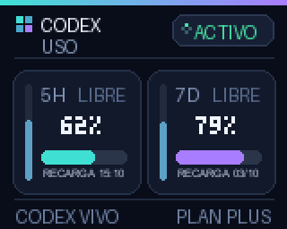 | 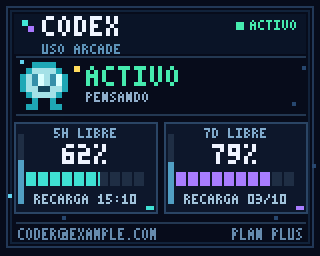 |
| `--theme neon` | `--theme pixel-art` |

El tema **anime** tiene cuatro variantes de color. El morado es el predeterminado:

| Morado | Rojo |
| --- | --- |
| 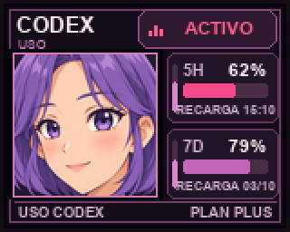 | 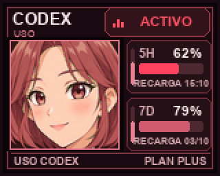 |
| `--theme anime --color purple` | `--theme anime --color red` |

| Azul | Verde |
| --- | --- |
| 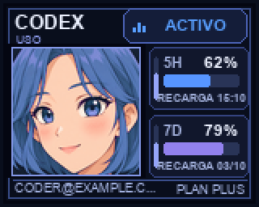 | 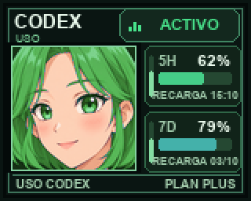 |
| `--theme anime --color blue` | `--theme anime --color green` |

Por ejemplo, inicia la variante verde así:

```sh
./start \
  --theme anime --color green
```

También puedes usar `-color` como alias de `--color`. En MiniToo, neón y pixel art tienen una sola paleta cada uno; si les asignas un color, el monitor avisa y usa los colores predeterminados del tema. Todos los temas con retrato anime parpadean alternando imágenes completas de la pantalla y animan el indicador ACTIVO. Pixel art anima el robot y el fondo; neón anima su indicador de actividad.

El retrato anime se creó para este proyecto a partir de una descripción escrita del personaje, sin imágenes externas de referencia. Sus archivos fuente, instrucciones de generación y exportación al tamaño de pantalla se documentan en [Procedencia de las ilustraciones](docs/ARTWORK.md).


### Anime pixel art

Selecciona **anime-pixel** para mostrar el retrato adulto en pixel art, con la cabeza ligeramente girada, cabello morado, rubor cálido y una sonrisa pequeña. Usa el [sprite adulto y su cuadro de parpadeo ya existentes](docs/ANIME_PIXEL_ARTWORK.md#sources-and-runtime-assets), con la forma de pestañas de ese cuadro. Solo cierran los ojos; la boca, las mejillas, el cabello y el fondo permanecen iguales. Conserva sus tonos RGB; `anime-pixel-chibi` mantiene su propio estilo compacto de 16 colores. El retrato de 78 × 78 conserva la interfaz del anime: cuota restante, tiempo hasta el refill, fechas de RECARGA, banco de reinicios y actividad animada, con texto de píxeles y marcos cuadrados. Los colores morado, rojo, azul y verde siguen disponibles. La primera opción de tema es `neon`; las ejecuciones siguientes recuperan tu elección guardada.

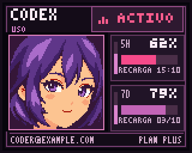

Soporta los mismos cuatro colores; el morado es el predeterminado:

| Morado | Rojo |
| --- | --- |
|  | 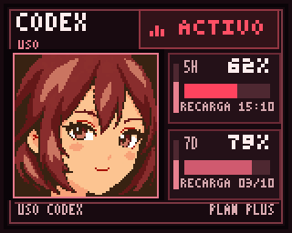 |
| `--theme anime-pixel --color purple` | `--theme anime-pixel --color red` |

| Azul | Verde |
| --- | --- |
| 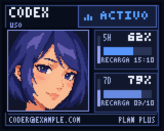 | 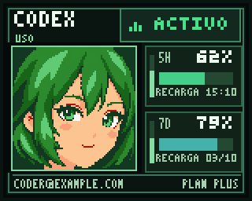 |
| `--theme anime-pixel --color blue` | `--theme anime-pixel --color green` |

```sh
./start \
  --theme anime-pixel --color green
```

| Una sola ventana de cuota | Banco de resets |
| --- | --- |
| 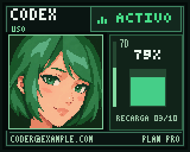 | 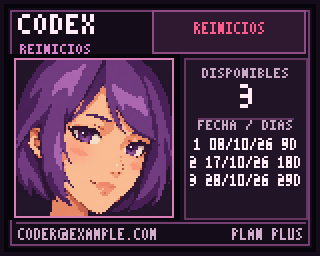 |

Los personajes pixel art comenzaron con generaciones independientes a partir de texto, seguidas de ajustes sobre sus propias imágenes. Los cuadros de ojos abiertos y cerrados se exportan a 78 × 78 como archivos RGB. Las dos versiones adultas conservan sus tonos RGB; la chibi usa una paleta artística. Los archivos fuente, los prompts y la exportación se documentan en [Procedencia del pixel art](docs/ANIME_PIXEL_ARTWORK.md).

### Anime pixel art detail

Selecciona **anime-pixel-detail** para conservar el retrato adulto original, con más detalle en el cabello, los ojos y el sombreado facial. Es la versión detallada guardada después de la comparación RGB satisfactoria. Conserva todos sus tonos RGB nativos y la misma interfaz, parpadeo, animación de actividad, banco de resets y cuatro colores. [Archivos y notas de restauración](docs/ANIME_PIXEL_ADULT_ORIGINAL_RGB.md).

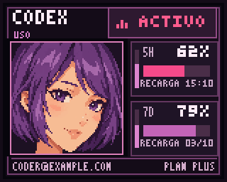

```sh
./start --address AA:BB:CC:DD:EE:FF --theme anime-pixel-detail --color green --encoding rgb
```

### Anime pixel art chibi

El personaje pixel anterior se conserva como **anime-pixel-chibi**, con rostro compacto y ojos grandes. Comparte la interfaz, el parpadeo y los colores `purple`, `red`, `blue` y `green` de la versión adulta. La chibi sonríe un poco más al cerrar los ojos; el retrato adulto normal simplemente pestañea. [Imágenes fuente y exportación de las sonrisas](docs/ANIME_PIXEL_SMILES.md).

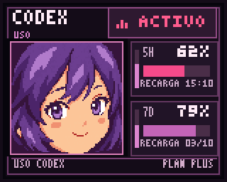

| Morado | Rojo |
| --- | --- |
| 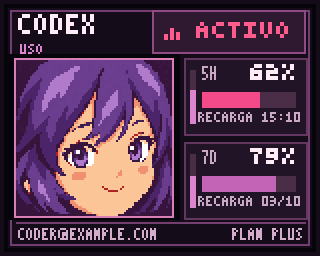 | 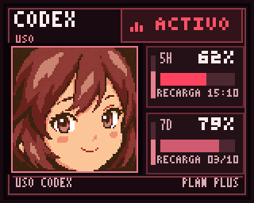 |
| `--theme anime-pixel-chibi --color purple` | `--theme anime-pixel-chibi --color red` |

| Azul | Verde |
| --- | --- |
| 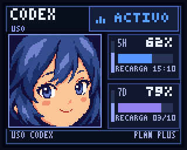 | 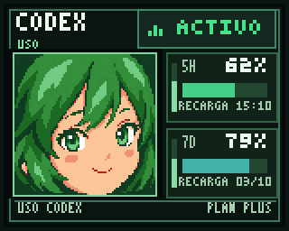 |
| `--theme anime-pixel-chibi --color blue` | `--theme anime-pixel-chibi --color green` |

### Pantalla 11 × 11 de TimeBox Mini

Cuando Codex está inactivo, TimeBox Mini alterna entre barras de cuota gruesas y el porcentaje restante de la ventana cuyo siguiente refill ocurrirá primero. Si hay dos ventanas, la más corta aparece arriba. Si solo hay una ventana 7D, se muestra una barra vertical centrada. Mientras Codex trabaja, una animación de pulsos ocupa toda la matriz; cada diez segundos se detiene durante dos segundos para mostrar el porcentaje restante.

La vista previa animada muestra la animación de trabajo, las barras de cuota, el porcentaje restante y la cantidad de resets. El GIF comprime la espera. En el dispositivo, la animación de trabajo se muestra ocho segundos y el porcentaje aparece dos segundos. En estado inactivo, las barras y el porcentaje se alternan cada diez segundos. Si hay créditos disponibles, la cantidad de resets aparece ocho segundos cada cinco minutos y ocupa temporalmente la pantalla.


Si la cuenta solo tiene una ventana 7D, esta vista previa muestra la barra vertical centrada y los demás estados de la pantalla:


El fondo es negro y el color de acento predeterminado es cian. Con `--color` puedes elegir **morado**, **rojo**, **azul** o **verde**. La pantalla de resets usa ese color y muestra la cantidad con números grandes.

Por ejemplo, selecciona el verde así:

```sh
./start \
  --device timebox-mini --color green
```

## Cómo leer la pantalla

### MiniToo

- **5H** y **7D** identifican las ventanas de uso que Codex devuelve para la cuenta. Algunos planes solo tienen una ventana.
- El porcentaje grande y la barra principal muestran el **uso restante**. Empiezan en 100 % y disminuyen a medida que usas Codex.
- La barra vertical delgada junto a cada ventana muestra **el tiempo que falta para el próximo refill**. Disminuye conforme se acerca.
- **RECARGA** (RESET en inglés) muestra la hora local estimada de recarga para una ventana corta o la fecha local para una ventana más larga.
- El pie muestra el correo de la cuenta en **MAYÚSCULAS** a la izquierda y el **PLAN** a la derecha, en todos los temas de MiniToo y en las pantallas de reinicios. Los correos largos se acortan con `...` para conservar visible el plan. Si el correo no está disponible, se omite.
- **ACTIVO** (WORK/WORKING en inglés) indica que un hook instalado detectó un turno de Codex dentro del alcance de actividad seleccionado. **REPOSO** (IDLE en inglés) indica que no hay turnos activos. **CONFIG** (SETUP en inglés) significa que no se detectaron hooks de actividad coincidentes. Si solo hay una ventana de uso, los temas anime muestran un medidor vertical más alto junto al retrato.

Por ejemplo, así se ve el tema anime con una sola ventana de uso Pro:

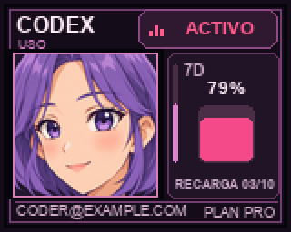

El correo se consulta mediante `account/read` del mismo Codex App Server/perfil local que devuelve las cuotas, en cada actualización de uso. No necesitas ninguna opción adicional. Si falla esta consulta opcional, el uso y los reinicios siguen mostrándose junto con el plan.

### TimeBox Mini

La pantalla de barras muestra la cuota restante. Si hay dos ventanas, la más corta es la barra superior y la más larga es la inferior. Si solo hay una ventana 7D, aparece una sola barra vertical centrada. La siguiente pantalla muestra únicamente el porcentaje restante (por ejemplo, **62 %**) de la ventana cuyo refill está más próximo. Mientras Codex trabaja, la animación pulsante llena la matriz durante ocho segundos y después muestra el porcentaje restante durante dos segundos; el ciclo se repite hasta que termina el turno.

### Pantalla de créditos de reset

Si tu cuenta tiene créditos de reset de límites disponibles, aparece una pantalla aparte **cada cinco minutos durante ocho segundos**. MiniToo muestra la cantidad disponible y hasta tres fechas de expiración con los días restantes. TimeBox Mini muestra solo la cantidad con números más grandes. Si Codex solo devuelve la cantidad, MiniToo la muestra sin fechas. Si no hay créditos disponibles, se omite esta pantalla. MiniToo usa el tema seleccionado; TimeBox Mini usa el color de acento elegido.

Ejemplos de la pantalla de resets de MiniToo:

| Neón | Pixel art | Anime |
| --- | --- | --- |
| 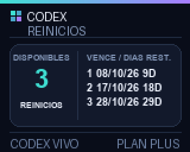 | 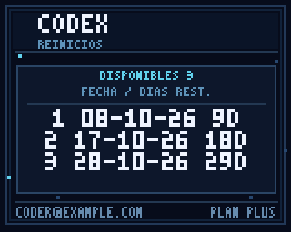 | 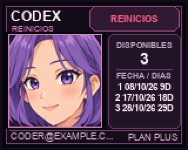 |

Las ventanas de uso y los datos de resets se obtienen mediante el método [`account/rateLimits/read`](https://learn.chatgpt.com/docs/app-server#6-rate-limits-chatgpt) de Codex App Server. Este proyecto solo muestra los créditos de reset; no los canjea.

También puedes pasar la dirección como una opción:

```sh
./start --address "AA:BB:CC:DD:EE:FF"
```

## Usar varias cuentas de Codex

Si tienes perfiles de Codex o Parall separados con distintas cuentas ChatGPT iniciadas, ejecuta `./start` y elige una cuenta con **↑ / ↓** y **Enter**. Se incluyen el perfil predeterminado de Codex, `CODEX_HOME` y los directorios `.codex` que existan dentro de las carpetas de instancias de Parall en `~/Library/Application Support/Parall/`, incluidas las instancias de Codex y ChatGPT. Son perfiles locales; una instancia puede aparecer aunque su aplicación esté cerrada. Los nombres identifican las carpetas, mientras que `account/read` confirma qué cuenta tiene sesión iniciada. El selector consulta Codex App Server sin leer ni copiar por sí mismo archivos de autenticación.

Por ejemplo, el menú puede mostrar estas cuentas ficticias:

```text
Codex · cuenta
  1. Codex · perfil predeterminado · PLAN PRO · PRINCIPAL@EXAMPLE.COM
› 2. Parall · Codex (Personal) · PLAN PLUS · PERSONAL@EXAMPLE.COM
```

Antes de mostrar el menú, el inicio consulta los datos de cuenta y pide cuotas actuales a cada perfil ChatGPT detectado. Solo se ofrecen los perfiles que devuelven ventanas de uso correctamente. Las comprobaciones se realizan una por una con tiempos de espera limitados para evitar renovaciones simultáneas de credenciales entre perfiles clonados. Un tiempo de espera agotado o una consulta fallida no se consideran una sesión utilizable; se informa el motivo cuando ningún perfil verificado representa esa cuenta.

Los perfiles con el mismo correo y plan comparten una sola opción en el menú. Un perfil con acceso al uso verificado tiene prioridad sobre un directorio guardado o un nombre de aplicación. Entre los perfiles verificados tiene prioridad el directorio guardado, o `CODEX_HOME` cuando todavía no se guardó ninguno. En caso contrario, la selección automática prioriza una instancia de Codex en Parall, después el perfil predeterminado de CLI, luego un perfil personalizado y finalmente las demás instancias de Parall. Usa `--codex-home` para elegir directamente un directorio concreto.

El correo y el plan identifican los datos locales de la cuenta; una consulta de uso correcta verifica el acceso en el momento de la selección. El inicio vuelve a pedir las cuotas antes de conectar Bluetooth porque las credenciales pueden cambiar mientras eliges bocina o tema. Si un perfil verificado devuelve entonces **401 Unauthorized**, la recuperación prueba los otros perfiles agrupados bajo esa cuenta después de comprobar de nuevo su correo y plan. El perfil que devuelve el uso correctamente pasa a ser la elección guardada. Los inicios con `--codex-home` directo o sin interacción usan exactamente el directorio resuelto y verifican las cuotas al conectar. Si se rechaza la autenticación y ningún intento alternativo funciona, el monitor muestra el directorio afectado y un comando `CODEX_HOME=... codex login`. No inicia sesión automáticamente.

Las consultas de identidad no fuerzan la renovación del token; Codex gestiona la autenticación de las consultas reales de uso. Los perfiles sin sesión, con clave API, con Bedrock, rechazados o no verificados no son seleccionables. Si ningún perfil devuelve cuotas actuales, el inicio se detiene con una explicación. Si no hay correo pero las cuotas se consultan correctamente, el perfil se ofrece sin correo y se mantiene separado porque no se puede comparar su identidad.

El último perfil se preselecciona en los siguientes inicios interactivos después de devolver el uso correctamente. Solo se guarda su ruta en `~/Library/Application Support/divoom-minitoo-codex/account.json`; ese archivo no guarda correos, planes ni credenciales. En un inicio interactivo se preselecciona el perfil guardado, o `CODEX_HOME` si todavía no se guardó ninguno. Cuando se omiten los menús, tiene prioridad `--codex-home`, después `CODEX_HOME`, luego el perfil guardado y finalmente el predeterminado de CLI. Once/preview no modifican esta preferencia. Si se eliminó una ruta guardada, el inicio interactivo permite elegir otra; una ejecución sin interacción informa que el perfil ya no existe.

Las barras de uso corresponden a la cuenta ChatGPT iniciada en el perfil seleccionado. Para elegir directamente una ruta y omitir el selector de cuenta, usa `--codex-home`:

```sh
./start \
  --codex-home "$HOME/Library/Application Support/Parall/ChatGPT (Personal)/.codex"
```

Sustituye la ruta por el directorio del perfil que uses. El monitor muestra el uso de una cuenta a la vez; reinícialo para seleccionar otro perfil. Por defecto, la actividad corresponde al perfil seleccionado y a los demás perfiles locales agrupados con el mismo correo y plan durante la detección interactiva. Una cuenta distinta en otra instancia de Parall o en la aplicación nativa no activa el indicador de esta cuenta. Los inicios directos o sin interacción siguen únicamente el perfil resuelto. Usa `--activity-scope all` para combinar todos los perfiles locales instalados. Esto no detecta trabajo en otro equipo ni conversaciones normales de ChatGPT que no ejecuten estos hooks de Codex. Las sesiones que solo usan una clave API o Bedrock no proporcionan las ventanas de uso de ChatGPT que necesita esta pantalla.

El monitor revisa la actividad cada segundo. Si falta `Stop`, se recupera cuando terminó el proceso de Codex o de la aplicación registrado, o cuando la transcripción local indicada por el hook contiene una finalización o interrupción de ese mismo turno. Estas comprobaciones no marcan como terminado un turno solo por llevar tiempo sin actividad. La recuperación por transcripción es auxiliar porque su formato no es una interfaz estable de Codex. Si no existe ninguna de esas señales, se conserva el límite de 24 horas como último recurso. `Stop` e `Interrupt` solo borran el turno coincidente; un evento atrasado no borra un turno nuevo, y terminar ya no genera un pulso adicional de ACTIVO.

## Opciones

Guarda una vista previa sin conectarte a un dispositivo Divoom ni indicar una dirección. Como usa datos de uso actuales, también necesitas un perfil de Codex con sesión iniciada:

```sh
./start --theme anime --color blue --preview preview.png
```

Para obtener una vista previa del diseño compacto de TimeBox Mini en azul:

```sh
./start --device timebox-mini --color blue --preview timebox-mini-preview.png
```

Envía una actualización y termina:

```sh
./start --once
```

Actualiza el uso cada 90 segundos (el mínimo es 10 segundos):

```sh
./start --interval 90
```

| Opción | Propósito |
| --- | --- |
| `start` | Comando opcional para iniciar el monitor. El lanzador del repositorio es `./start`. |
| `--address ADDRESS` | Dirección MAC Bluetooth manual opcional; también acepta `MINITOO_ADDRESS`. Omítela para detectar bocinas emparejadas. |
| `--device DEVICE` | Filtra la detección a `minitoo` o `timebox-mini`; una dirección explícita sin esta opción usa MiniToo |
| `--theme neon`, `--theme pixel-art`, `--theme anime`, `--theme anime-pixel`, `--theme anime-pixel-chibi`, `--theme anime-pixel-detail` | Tema MiniToo; el parámetro explícito tiene prioridad sobre la preferencia guardada. Primera opción: `neon`. TimeBox Mini siempre usa su diseño compacto. |
| `--color`, `-color` | Reemplaza el color guardado. TimeBox Mini: `cyan` (inicial), `purple`, `red`, `blue`, `green`; temas con retrato MiniToo: `purple` (inicial), `red`, `blue`, `green` |
| `--language en`, `--language es`, `--lang` | Idioma del CLI y la pantalla; tiene prioridad sobre la elección guardada. Primera opción: inglés |
| `--no-prompt` | Omite los menús; usa idioma/tema/color explícitos o las preferencias guardadas |
| `--sent compact`, `--sent detailed` | Una línea de estado actualizable (predeterminado) o una línea completa por cada envío; la salida redirigida usa líneas simples |
| `--codex-home PATH` | Selecciona directamente un perfil de Codex; tiene prioridad sobre el selector y la preferencia guardada |
| `--activity-scope account\|all` | Sigue los perfiles locales de la cuenta seleccionada (predeterminado) o combina todos los perfiles locales instalados |
| `--codex-bin PATH` | Ejecutable de Codex CLI; también acepta `CODEX_BIN` |
| `--interval SECONDS` | Intervalo entre consultas de uso; predeterminado: `60`, mínimo: `10` |
| `--encoding rgb`, `--encoding jpeg` | Codificación MiniToo; RGB888/Zstandard sin pérdida por defecto. JPEG sigue disponible explícitamente. TimeBox Mini siempre usa RGB444. |
| `--preview FILE` | Guarda un PNG sin usar Bluetooth |
| `--once` | Envía una actualización y termina |
| `--log-file FILE` | Archivo de diagnóstico; predeterminado: `~/Library/Logs/divoom-minitoo-codex/<device>-<port>.log`. Privado (`0600`); rota a 1 MiB y conserva dos respaldos. |

Si `codex` no está en el `PATH` de Terminal, establece `CODEX_BIN` con la ruta al ejecutable de CLI:

```sh
CODEX_BIN="/ruta/a/codex" ./start
```

## Soporte de animaciones

Los temas MiniToo envían cuadros completos para sus animaciones, en **RGB888/Zstandard sin pérdida por defecto** o JPEG con `--encoding jpeg`. RGB comprime toda la secuencia conservando los colores y tiempos de cada cuadro. La [prueba RGB nativa](docs/MINITOO_RGB.md) puede ayudar a diagnosticar problemas de pantalla en tu firmware. TimeBox Mini usa su propio protocolo Bluetooth RGB444 para una matriz de 11 × 11 y envía una nueva imagen de la matriz cada segundo durante la animación de actividad de pantalla completa. No carga un GIF. Cuando está inactivo, alterna entre las barras de cuota y el porcentaje restante para la recarga más próxima. MiniToo usa el canal Bluetooth RFCOMM 1; TimeBox Mini usa el canal 4. Sus puentes locales usan los puertos `40584` y `40585`, respectivamente, así que ambos monitores pueden ejecutarse a la vez. El protocolo de imagen de TimeBox Mini sigue la [documentación de la comunidad](https://github.com/MarcG046/timebox/blob/master/doc/protocol.md), no una API pública de Divoom.

## Solución de problemas

- **No se detecta la bocina:** Enciéndela, activa Bluetooth y empareja la bocina en los ajustes Bluetooth de macOS. Autoriza el acceso Bluetooth de Terminal si macOS lo solicita. La detección reconoce los nombres de los modelos compatibles; si cambiaste el nombre, puedes usar la dirección manual en el menú. Ejecuta otra vez `./install` si falta el detector. Otros modelos Divoom no se seleccionan automáticamente.
- **Tablero de ajedrez o manchas en detalles finos del MiniToo:** En una [comparación física JPEG frente a RGB](docs/MINITOO_CODEC_COMPARISON.md), RGB sin pérdida eliminó el defecto en la imagen de prueba de 128 × 128. Usa la [prueba RGB nativa](docs/MINITOO_RGB.md) para el dashboard completo y las animaciones; si se muestran correctamente, selecciona `--encoding rgb`. La [comparación de calidad JPEG](docs/JPEG_QUALITY_COMPARISON.md) sigue disponible para diagnóstico.
- **No aparecen las barras de uso:** Inicia sesión en un perfil de ChatGPT con uso de Codex. Si utilizas otro perfil, pasa su ruta con `--codex-home`.
- **401 Unauthorized / no se pudo interpretar el token de autenticación:** Se rechazó la credencial usada para consultar las cuotas de la cuenta. El inicio interactivo omite las cuentas cuyos perfiles no pasan la consulta de uso actual. Las credenciales todavía pueden vencer o cambiar después de esa comprobación. Reinicia `./start` para verificar los perfiles de nuevo; el inicio puede recuperarse con un perfil coincidente si la autenticación cambia después de seleccionarlo. Si todos fallan, ejecuta el comando de inicio de sesión que se muestra para el directorio afectado y reinicia el monitor. Cada perfil de Parall tiene su propio estado de sesión; iniciar sesión en el perfil predeterminado de CLI puede no reparar el perfil seleccionado. Consulta la [documentación de autenticación de Codex App Server](https://learn.chatgpt.com/docs/app-server#auth-endpoints).
- **El puente no devuelve datos o la respuesta no es válida:** Ejecuta otra vez `./install` para recompilar los puentes, confirma que el dispositivo esté enlazado y revisa su dirección MAC. Para TimeBox Mini, cierra la aplicación Divoom al conectar.
- **TimeBox Mini no puede abrir el canal RFCOMM 4:** Detén el monitor con `Ctrl+C` y vuelve a iniciarlo con `./start`. Si continúa el mismo error del canal, cierra la aplicación Divoom y cualquier otro monitor Divoom, apaga TimeBox Mini durante 10 segundos, vuelve a encenderlo y reinicia `./start`. El monitor muestra estos pasos de recuperación al detectar el fallo al abrir el canal.
- **Se perdió la conexión, se detuvo el puente o no se confirmó una transferencia:** El monitor cierra el puente fallido e intenta una vez con una sesión Bluetooth nueva. Si ambos intentos fallan, el monitor continuo sigue ejecutándose e intenta de nuevo con pausas de 5, 10, 20, 40 y hasta 60 segundos. No marca como completada una transferencia fallida. `--once` termina con un error si los dos intentos fallan. Los mensajes muestran la etapa de conexión, el código de salida del puente cuando está disponible y sus logs recientes.
- **MiniToo se queda en la pantalla de carga:** El puente procesa pedidos de bloques durante la transferencia, valida las sumas de comprobación de los paquetes y reconoce la [confirmación final capturada](https://github.com/alvinunreal/divoom-minitoo-osx/blob/main/PROTOCOL.md#final-ack) en vez de tomar cualquier respuesta como confirmación. Exige que MiniToo solicite los datos en los primeros 5 segundos; si no responde, no envía imágenes y reconecta. Espera hasta 10 segundos por un bloque solicitado, limita la transferencia Bluetooth a 40 segundos y espera hasta 60 segundos la respuesta local. La recuperación ocurre en cualquier pantalla. Si el dispositivo ya quedó bloqueado por una transferencia anterior incompleta, detén el monitor, cierra la aplicación Divoom y la conexión de audio Bluetooth de MiniToo, apaga y enciende MiniToo, y reinicia el monitor. Si falta la confirmación, la transferencia no está confirmada; eso no demuestra por sí solo que no se haya actualizado la pantalla.
- **Diagnóstico de un bloqueo recurrente:** Cada monitor guarda logs con fecha y hora, errores y salida del puente, incluidos los bytes de control Bluetooth recibidos. El log predeterminado de MiniToo es `~/Library/Logs/divoom-minitoo-codex/minitoo-40584.log`; TimeBox Mini usa `~/Library/Logs/divoom-minitoo-codex/timebox-mini-40585.log`. La ruta completa se muestra al iniciar. Puedes elegir otra con `--log-file /ruta/al/monitor.log`. Al reportar un bloqueo, incluye la sección del log correspondiente: permite distinguir si el dispositivo no responde o si llegó una respuesta que el puente no reconoce. Los logs pueden incluir direcciones de conexión y porcentajes de uso mostrados; no contienen prompts, tokens de acceso ni imágenes.
- **El puerto local ya está en uso:** Detén el otro monitor del mismo modelo. El monitor espera el aviso de disponibilidad de su propio puente; otro proceso que escucha ese puerto no se considera una conexión correcta. MiniToo y TimeBox Mini pueden funcionar a la vez porque usan distintos puertos predeterminados (`40584` y `40585`).
- **La pantalla no muestra ACTIVO / WORK:** Ejecuta `.venv/bin/python scripts/install_activity_hooks.py status --all-profiles`. Si falta configuración, ejecuta el mismo comando con `install` en lugar de `status`; incluye las instancias de Codex y ChatGPT de Parall. Mantén el monitor en ejecución, revisa y autoriza los hooks de Divoom con `/hooks` en el mismo perfil que recibió el prompt y reinicia ese perfil. El hook no responde en la conversación de Codex; actualiza `~/.codex/divoom-minitoo-codex-activity.json` para que lo lea el monitor.
- **ACTIVO permanece visible o viene de otra cuenta:** Reinicia con el valor predeterminado `--activity-scope account`, actualiza los hooks con `install --all-profiles`, autoriza sus nuevas definiciones y reinicia las instancias afectadas de Codex. La instalación descarta los registros antiguos sin perfil de origen. Cuando existe la evidencia correspondiente, las comprobaciones de proceso terminado y finalización del mismo turno recuperan eventos de cierre ausentes; por defecto el monitor no suma la actividad de otra cuenta.
- **macOS deniega el acceso a Bluetooth:** Autoriza Bluetooth para el proceso que ejecuta el puente en Configuración del Sistema de macOS.
- **Aparece un reloj de arena durante una actualización MiniToo:** MiniToo puede mostrar su propia pantalla de transferencia/carga al recibir imágenes modificadas. El monitor evita enviar imágenes idénticas, pero un cambio visible puede activar esa pantalla.

## Comprobaciones de conexión para desarrollo

Ejecuta las simulaciones de fallos con:

```sh
.venv/bin/python -m unittest discover -s tests -v
```

Estas comprobaciones cubren errores de socket, disponibilidad y apagado de procesos, respuestas incompletas, intentos de reconexión, reintentos de la misma pantalla con pausa y logs persistentes. En macOS con Swift instalado, también compilan el código real de transferencia MiniToo y lo ejecutan con un canal RFCOMM en memoria para revisar paquetes fragmentados, sumas de comprobación, pedidos de bloques faltantes, acuses finales, desconexiones y el caso de un dispositivo silencioso que no debe recibir una animación enviada a ciegas. No abren conexiones Bluetooth; el comportamiento físico del dispositivo debe comprobarse aparte.

## Desinstalar los hooks

Elimina los hooks de actividad Divoom de CLI y de los perfiles de Codex App detectados con:

```sh
.venv/bin/python scripts/install_activity_hooks.py uninstall --all-profiles
```

Los demás hooks de esos perfiles se conservan. Este comando no elimina el entorno de Python ni el puente Swift.

## Privacidad y mantenimiento de la galería

El monitor no lee ni guarda tokens de acceso. Los hooks de actividad guardan rutas de perfiles locales, identificadores de sesión y turno, marcas de tiempo, un identificador del proceso propietario cuando está disponible y una ruta opcional de transcripción local; no guardan prompts, respuestas ni salida de herramientas. Si falta un hook de cierre, el monitor puede leer hasta 256 KiB del final de esa transcripción y conservar únicamente identificadores y marcas de tiempo de eventos de finalización. El contenido de la transcripción no se escribe en logs, no se guarda ni se sube. Los datos de uso y el correo se consultan localmente mediante Codex App Server y se representan en las imágenes de MiniToo. El generador de la galería solo usa valores de ejemplo y un correo ficticio; no consulta tu cuenta.

Después de cambiar un renderizador, regenera las imágenes de ejemplo del README con:

```sh
.venv/bin/python scripts/generate_theme_gallery.py --language all
```


## Licencia y contribuciones

Este proyecto usa la [licencia MIT](LICENSE): permite compartir, modificar y reutilizar el proyecto conservando sus avisos. Incluye el código, la documentación y el arte creado para el proyecto en la medida en que existan derechos aplicables. Las marcas y dependencias mantienen sus propias condiciones; consulta [THIRD_PARTY_NOTICES.md](THIRD_PARTY_NOTICES.md).

El arte actual y sus descripciones de generación están documentados en [anime](docs/ARTWORK.md) y [pixel adulto/chibi](docs/ANIME_PIXEL_ARTWORK.md). Las imágenes de la galería usan datos de ejemplo. Consulta [CONTRIBUTING.md](CONTRIBUTING.md) y [SECURITY.md](SECURITY.md) para contribuir o reportar una vulnerabilidad.

Los puentes comprueban una credencial nueva por proceso antes de aceptar imágenes. Se entrega por una tubería privada, sin guardarla en argumentos, variables de entorno ni logs. Los logs nuevos y rotados usan permisos `0600`; la carpeta predeterminada usa `0700`. Los logs anteriores del directorio `build/` también se protegen al iniciar con la configuración predeterminada. Revisa direcciones Bluetooth y rutas personales antes de adjuntar un log.

La terminal muestra al iniciar el modelo, tema, color, intervalo y ruta del log. `NO_COLOR=1` desactiva los colores; al redirigir la salida se conservan mensajes simples.


Para la primera publicación con historial limpio, consulta [PUBLIC_RELEASE.md](docs/PUBLIC_RELEASE.md).
