# Codex usage on Divoom displays

[English](README.md) | [Español](README.es.md)

Show your Codex usage, refill times, activity, and available reset credits on a Divoom MiniToo or TimeBox Mini. The monitor reads the signed-in account through the local Codex App Server. MiniToo receives a 160 × 128 dashboard; TimeBox Mini receives a compact screen for its 11 × 11 LED matrix.

This version runs on **macOS**. MiniToo includes six themes: **neon**, **pixel-art**, **anime**, **anime-pixel** (adult in the chibi drawing style), **anime-pixel-chibi**, and **anime-pixel-detail** (detailed adult). TimeBox Mini uses one compact layout designed for its 11 × 11 LED matrix, with optional accent colors. [See the theme gallery](#themes-and-colors).

## Requirements

- A Divoom MiniToo or TimeBox Mini paired with your Mac
- macOS with Bluetooth enabled
- Python 3.10 or later
- Xcode Command Line Tools (`swiftc`); install with `xcode-select --install` if needed
- [Codex CLI](https://learn.chatgpt.com/docs/codex/cli) installed and signed in to a ChatGPT account with Codex usage limits

The monitor runs in Terminal and needs to stay open to keep the display updated. It does not install a background service.

## Install

Clone this repository in Terminal, then run:

```sh
git clone https://github.com/AFrayde01/divoom-minitoo-codex.git
cd divoom-minitoo-codex
./scripts/install.sh
```

The installer creates a Python virtual environment, builds Bluetooth bridges for both Divoom models, and installs the Codex activity hooks. It installs hooks in `CODEX_HOME` (or `~/.codex`) and any detected Codex App profiles under `~/Library/Application Support/Parall/ChatGPT*/.codex`. All profiles use the same local activity state file.

Codex requires non-managed hooks to be reviewed and trusted before they run. In each profile you use, start a Codex CLI session with that profile's `CODEX_HOME`, run `/hooks`, review and trust the Divoom hooks, then restart that profile. For a separate profile, start the CLI with `CODEX_HOME="/path/to/profile/.codex" codex`. The installer backs up any existing `hooks.json` before updating it and preserves other hooks. See the [Codex hooks guide](https://learn.chatgpt.com/docs/hooks#review-and-trust-hooks).

If you add a Codex profile later, install its hooks with:

```sh
.venv/bin/python scripts/install_activity_hooks.py install \
  --codex-home "/path/to/profile/.codex"
```

## Update an existing installation

Stop the monitor with `Ctrl+C`, update your repository checkout and run `./scripts/install.sh` again. Rebuild **both bridges** to enable local authentication; an older binary is rejected with an upgrade message. Then restart the monitor. Existing hooks retain their configuration; review `/hooks` if Codex asks you to trust an updated hook.

The update also installs the lossless RGB compressor and rebuilds MiniToo's RGB-capable bridge. **Lossless RGB888/Zstandard is now the MiniToo default**, at the native 160 × 128 size. You do not need to pass `--encoding rgb`. Use `--encoding jpeg` to explicitly select JPEG. [RGB usage and native display check](docs/MINITOO_RGB.md).

## Find the Divoom Bluetooth address (optional)

`./start` automatically reads supported paired speakers from macOS Bluetooth, so you normally do not need an address. Pair the speaker in macOS Bluetooth settings first. Detection recognizes MiniToo and TimeBox Mini by their Bluetooth names; if you renamed yours or want to specify one manually, find its address as follows:

1. Turn on the Divoom device and pair it in **System Settings → Bluetooth**.
2. Open **System Information → Hardware → Bluetooth**, find the MiniToo or TimeBox Mini in the device list, and copy its **Address**. You can also inspect the list in Terminal:

   ```sh
   system_profiler SPBluetoothDataType
   ```

3. Use the Divoom device's Bluetooth address, in a format like `AA:BB:CC:DD:EE:FF`. This is not your Mac's Bluetooth address or an IP address.

If the MiniToo is connected as a Bluetooth audio device, disconnect that audio profile before starting the monitor. For TimeBox Mini, close the Divoom app if it already has an active connection.

## Start the monitor

Start the continuous monitor with:

```sh
./start
```

If macOS has one supported Divoom paired, its address and model are selected automatically. If there are several, choose the speaker from the menu; currently connected speakers appear first, with MiniToo preferred when connection status is equal. Connected status does not guarantee that the image channel is free or that a disconnected paired speaker is powered on. The monitor then offers the theme and supported color, with your previous choices selected. The first MiniToo theme is **neon**. TimeBox Mini uses its compact layout and offers its accent colors.

To show only TimeBox Mini devices:

```sh
./start --device timebox-mini
```

Keep Terminal open while it runs; stop it with `Ctrl+C`. It reads usage at startup and every 60 seconds, checks activity every second, and reads usage again when a Codex turn ends. It sends an image when the display changes. The hook is silent in the Codex conversation; its status appears on the display.

### Startup choices and terminal output

- Use **↑ / ↓** to move through languages, speakers, themes and colors, then **Enter** to select. Numbers **1–9** jump to an option; **Esc / Q** or **Ctrl+C** cancel. Press Enter immediately to keep the highlighted choice. Terminals without key-mode support fall back to number/name input. Anime colors start with purple; TimeBox Mini starts with cyan. Neon and the robot pixel-art theme use fixed palettes.
- Explicit `--language`, `--theme` and `--color` values take priority and skip their respective questions. Continuous runs remember theme/color choices separately for each device and one shared language.
- Add `--no-prompt` to start directly with explicit options or your saved choices. `--once`, `--preview`, redirected input/output and `TERM=dumb` also skip the menu; once/preview runs leave saved choices unchanged.
- Without a menu, automatic detection must find exactly one matching speaker; otherwise specify `--device` or `--address`. An explicit address (or `MINITOO_ADDRESS`) bypasses detection; without a model, an explicit address uses MiniToo. Preview defaults to MiniToo without reading Bluetooth.
- Transfer updates **replace one status line** by default. It shows the latest send time, remaining quota, activity and displayed page. Long status text is clipped to fit the terminal; errors and the diagnostic log retain full details.
- Add `--sent detailed` for one complete line per successful send, including TimeBox Mini animation frames. Redirected output always uses plain lines.

For example:

```sh
./start --no-prompt
./start --sent detailed
```

Preferences are stored locally in `~/Library/Application Support/divoom-minitoo-codex/minitoo.json` or `timebox-mini.json`. These private files contain only the theme and color. The shared CLI/display language is stored in `language.json` in the same directory. If they cannot be saved, the monitor continues and prints a notice.

`./start` uses the repository's virtual environment without requiring activation. After installation, `.venv/bin/divoom-codex start` and the existing `.venv/bin/codex-minitoo` entry point are also available. All support the same options. If no speaker is detected in an interactive terminal, the menu lets you retry after pairing or enter an address manually.

### Language

Run the CLI and all MiniToo themes in Spanish:

```sh
./start --language es
```

Use `--language en` for English, or `--lang` as an alias. `./start` offers a **Language / Idioma** selector before the speaker/theme/color menus and highlights the last selection. The initial language is English. `--no-prompt` restores the saved language; an explicit flag overrides it. Continuous runs save the language, while `--once`, `--preview` and `--help` do not change preferences.

The language applies to menus, help, monitor messages and every theme's usage/reset-credit screen. Spanish dates use **day/month** (with a two-digit year on reset-credit lists); hours stay in 24-hour format. The compact display uses **ACTIVO**, **REPOSO**, **RECARGA** and **REINICIOS**. TimeBox Mini keeps its language-independent numbers and bars. Command values such as `green` and `anime-pixel` stay the same; native Bluetooth/protocol diagnostics stay verbatim for troubleshooting.

## Themes and colors

These previews are generated by the same renderers used for each device. The percentages and reset counts are illustrative. The gallery below shows MiniToo; use `./start --device timebox-mini` for the compact TimeBox Mini layout.

| Neon (first-start default) | Pixel art |
| --- | --- |
| 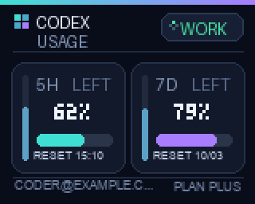 | 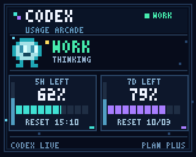 |
| `--theme neon` | `--theme pixel-art` |

The **anime** theme has four color variants. Purple is the default:

| Purple | Red |
| --- | --- |
| 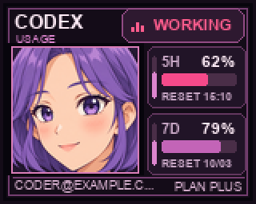 | 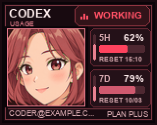 |
| `--theme anime --color purple` | `--theme anime --color red` |

| Blue | Green |
| --- | --- |
| 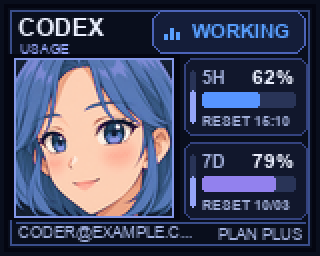 | 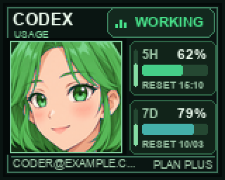 |
| `--theme anime --color blue` | `--theme anime --color green` |

For example, start the green variant with:

```sh
./start \
  --theme anime --color green
```

`-color` also works as an alias for `--color`. On MiniToo, neon and pixel art have one palette each; if you pass a color with either theme, the monitor prints a notice and uses that theme's default colors. All anime portrait themes blink by cycling through complete display frames and animate their WORKING badge. Pixel art animates its robot and background; neon animates its working indicator.

The anime portrait was created for this project from a written character brief, with no external reference images. Its source files, generation prompts and native-frame export instructions are recorded in [Artwork provenance](docs/ARTWORK.md).


### Anime pixel art

Select **anime-pixel** for an adult woman around 24, drawn in the same simple retro sprite style as the chibi: broad connected hair shapes, clean pixel contours, a compact nose and a short closed smile. Adult proportions and smaller almond eyes distinguish her from the chibi. The [adult sprite brief and sources](docs/ANIME_PIXEL_ADULT_RETRO.md) document this revision. Both use a shared artistic palette of up to 16 colors, not a hardware color limit. The native 78 × 78 portrait keeps the anime dashboard: remaining quota, refill countdowns, RESET dates, reset bank and animated activity, with bitmap text and square frames. Skin, cheeks and background remain identical during a blink. Purple, red, blue and green remain supported. The first-start theme is `neon`; later runs restore your saved choice.

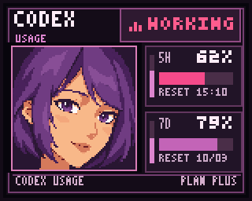

The same four colors are supported; purple is the default:

| Purple | Red |
| --- | --- |
| 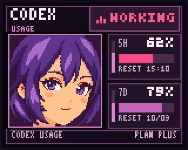 | 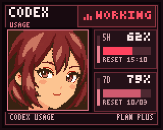 |
| `--theme anime-pixel --color purple` | `--theme anime-pixel --color red` |

| Blue | Green |
| --- | --- |
| 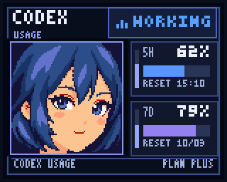 | 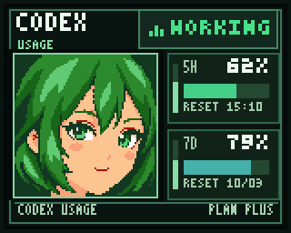 |
| `--theme anime-pixel --color blue` | `--theme anime-pixel --color green` |

```sh
./start \
  --theme anime-pixel --color green
```

| Single quota window | Reset bank |
| --- | --- |
| 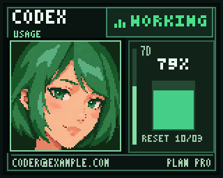 | 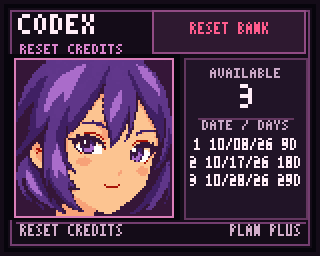 |

The pixel characters began with independent text-only generations, followed by edits using only this project's own generated artwork. Open-eye and blink images are exported at 78 × 78 as RGB runtime assets. The simple adult and chibi use an artistic palette; the detailed adult preserves its full RGB tones. Sources, prompts and export details are recorded in [Pixel artwork provenance](docs/ANIME_PIXEL_ARTWORK.md).

### Anime pixel art detail

Select **anime-pixel-detail** to keep the original adult portrait with its richer hair, eyes and facial shading. This is the detailed version preserved after the successful RGB comparison. It keeps its full native RGB tones and the same dashboard, blink, WORKING animation, reset bank and four colors. [Sources and restoration notes](docs/ANIME_PIXEL_ADULT_ORIGINAL_RGB.md).

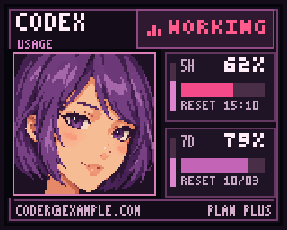

| Purple | Red |
| --- | --- |
| 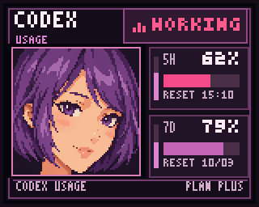 | 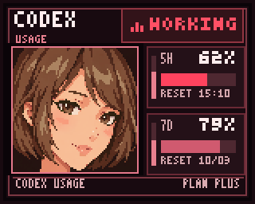 |
| `--theme anime-pixel-detail --color purple` | `--theme anime-pixel-detail --color red` |

| Blue | Green |
| --- | --- |
| 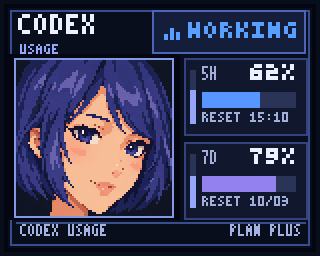 | 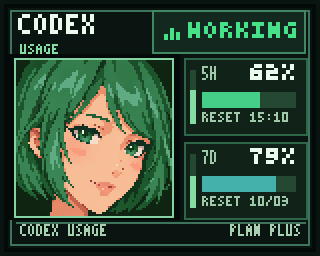 |
| `--theme anime-pixel-detail --color blue` | `--theme anime-pixel-detail --color green` |

| Single quota window | Reset bank |
| --- | --- |
|  | 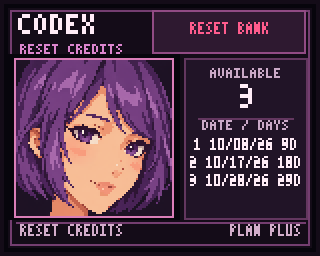 |

```sh
./start --address AA:BB:CC:DD:EE:FF --theme anime-pixel-detail --color green --encoding rgb
```

### Anime pixel art chibi

The previous pixel character is preserved as **anime-pixel-chibi**, with a compact face and large eyes. It shares the adult variant's layout, blink and `purple`, `red`, `blue` and `green` colors. Both simple pixel characters have a gentle smile with their eyes open and a broader smile during the closed-eye frame. [Smile sources and animation export](docs/ANIME_PIXEL_SMILES.md).


| Purple | Red |
| --- | --- |
| 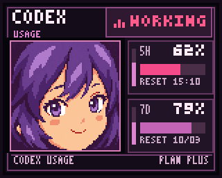 | 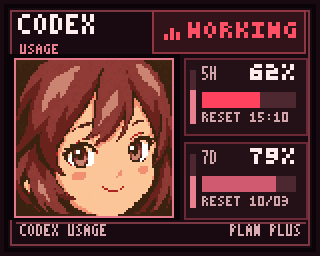 |
| `--theme anime-pixel-chibi --color purple` | `--theme anime-pixel-chibi --color red` |

| Blue | Green |
| --- | --- |
| 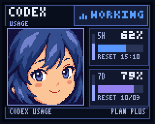 | 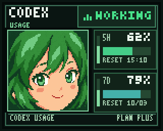 |
| `--theme anime-pixel-chibi --color blue` | `--theme anime-pixel-chibi --color green` |

### TimeBox Mini 11 × 11 display

When Codex is idle, TimeBox Mini alternates between thick quota bars and only the remaining percentage for the window with the nearest upcoming refill. When both windows are available, the shorter window appears above the longer one. If only a 7D window is available, it uses one centered vertical bar. While Codex is working, a full-matrix pulse animation fills the display; every ten seconds, it pauses for two seconds to show the remaining percentage.

The animated preview shows the working animation, the quota bars, the remaining percentage, and the reset count. The GIF compresses the wait. On the device, the working animation runs for eight seconds, then the percentage appears for two seconds. While idle, bars and percentage alternate every ten seconds. If credits are available, the reset count appears for eight seconds every five minutes and temporarily takes over the display.


When an account only has a 7D window, this preview shows the centered vertical bar and its other display states:


The default accent is cyan. You can choose **purple**, **red**, **blue**, or **green** with `--color`. The reset-count screen uses the selected accent and shows only the count in larger digits.

For example, select green with:

```sh
./start \
  --device timebox-mini --color green
```

## Read the display

### MiniToo

- **5H** and **7D** identify the Codex usage windows returned for the account. Some plans return only one window.
- The large percentage and main bar show **usage remaining**, starting at 100% and shrinking as Codex is used.
- The slim vertical bar beside each window shows **time remaining until that window refills**. It shrinks toward the refill.
- **RESET** shows the expected local refill time for a short window or local date for a longer window.
- **WORK/WORKING** means an installed activity hook sees an active Codex turn. **IDLE** means no active turn. **SETUP** means activity hooks have not been detected. When only one usage window is available, the anime portrait themes use a taller vertical meter beside the portrait.

For example, the anime layout with a single Pro usage window looks like this:

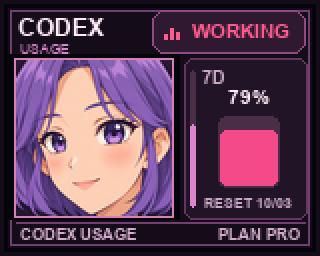

### TimeBox Mini

The quota-bar screen shows remaining quota. If there are two windows, the shorter window is the upper bar and the longer window is the lower bar. If only one window is available and it is 7D, one centered vertical bar is shown. The next screen shows only the remaining percentage (for example, **62%**) for the window with the nearest upcoming refill. During WORKING, the full matrix shows the pulsing animation for eight seconds, then the remaining percentage for two seconds, repeating until the turn ends.

### Reset-credit screen

If your account has available rate-limit reset credits, a separate screen appears **every five minutes for eight seconds**. MiniToo shows the available count and up to three expiry dates with days remaining. TimeBox Mini shows only the count in larger digits. If Codex returns only the count, MiniToo still shows it without dates. With zero available credits, this screen is skipped. MiniToo uses the selected theme; TimeBox Mini uses the selected accent.

MiniToo reset-screen examples:

| Neon | Pixel art | Anime |
| --- | --- | --- |
| 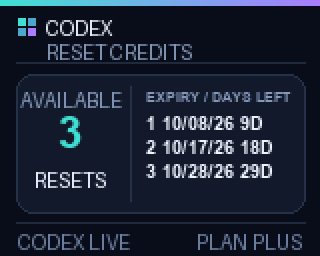 | 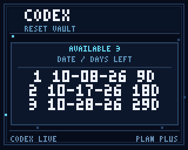 | 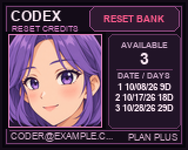 |

The usage windows and reset-credit details come from Codex App Server's [`account/rateLimits/read`](https://learn.chatgpt.com/docs/app-server#6-rate-limits-chatgpt) method. This project only displays reset credits; it does not redeem them.

You can also pass the address as an option:

```sh
./start --address "AA:BB:CC:DD:EE:FF"
```

## Choose a Codex account profile

The usage bars belong to the ChatGPT account signed in to the selected Codex profile. If you use separate profiles for a main and Personal account, select one with `--codex-home`:

```sh
./start \
  --codex-home "$HOME/Library/Application Support/Parall/ChatGPT (Personal)/.codex"
```

Substitute the profile directory you actually use. You can also set `CODEX_HOME` in the environment. Without either option, the CLI's default profile is used. The monitor displays one account's usage at a time; restart it after switching the selected account. Activity can still reflect turns from any installed, trusted profile because the hooks share a local activity file. API-key-only and Bedrock sessions do not provide the ChatGPT usage windows this display needs.

## Options

Save a preview without connecting to a Divoom display or providing an address. A signed-in Codex profile is still required because the preview uses live usage data:

```sh
./start --theme anime --color blue --preview preview.png
```

To preview the compact TimeBox Mini layout in blue:

```sh
./start --device timebox-mini --color blue --preview timebox-mini-preview.png
```

Send one update and exit:

```sh
./start --once
```

Refresh usage every 90 seconds (the minimum is 10 seconds):

```sh
./start --interval 90
```

| Option | Purpose |
| --- | --- |
| `start` | Optional command; starts the monitor. The repository launcher is `./start`. |
| `--address ADDRESS` | Optional manual Bluetooth MAC address; also accepts `MINITOO_ADDRESS`. Omit for paired-speaker detection. |
| `--device DEVICE` | Filters automatic detection to `minitoo` or `timebox-mini`; an explicit address without this option uses MiniToo |
| `--theme neon`, `--theme pixel-art`, `--theme anime`, `--theme anime-pixel`, `--theme anime-pixel-chibi`, `--theme anime-pixel-detail` | MiniToo theme; explicit option overrides the saved choice. Initial choice: `neon`. TimeBox Mini always uses its compact layout. |
| `--color`, `-color` | Overrides the saved color. TimeBox Mini: `cyan` (initial), `purple`, `red`, `blue`, `green`; MiniToo portrait themes: `purple` (initial), `red`, `blue`, `green` |
| `--language en`, `--language es`, `--lang` | CLI and display language; overrides the saved choice. Initial choice: English |
| `--no-prompt` | Skip startup selection; use explicit language/theme/color or saved choices |
| `--sent compact`, `--sent detailed` | Compact single-row status (default) or a complete line for every sent update; redirected output uses plain lines |
| `--codex-home PATH` | Codex profile for usage data; also accepts `CODEX_HOME` |
| `--codex-bin PATH` | Codex CLI executable; also accepts `CODEX_BIN` |
| `--interval SECONDS` | Usage refresh interval; default: `60`, minimum: `10` |
| `--encoding rgb`, `--encoding jpeg` | MiniToo encoding; default: lossless RGB888/Zstandard. JPEG remains available explicitly. TimeBox Mini always uses RGB444. |
| `--preview FILE` | Write one PNG without Bluetooth |
| `--once` | Send one update, then exit |
| `--log-file FILE` | Diagnostic log; default: `~/Library/Logs/divoom-minitoo-codex/<device>-<port>.log`. Private (`0600`); rotates at 1 MiB with two backups. |

If `codex` is not on Terminal's `PATH`, set `CODEX_BIN` to the CLI executable:

```sh
CODEX_BIN="/path/to/codex" ./start
```

## Animation support

MiniToo themes send complete frames for their animations, using **lossless RGB888/Zstandard by default** or JPEG with `--encoding jpeg`. RGB compresses the full sequence together while preserving frame colors and timing. The [native RGB check](docs/MINITOO_RGB.md) can help diagnose display issues on your firmware. TimeBox Mini uses its own 11 × 11 RGB444 Bluetooth protocol and sends a new matrix image once per second while the full-screen WORKING animation runs. It does not upload a GIF. While idle, it alternates between quota bars and the remaining percentage for the nearest refill. The MiniToo uses Bluetooth RFCOMM channel 1, while TimeBox Mini uses channel 4. Their local bridges use ports `40584` and `40585`, respectively, so both model monitors can run at the same time. The TimeBox Mini image protocol follows [community documentation](https://github.com/MarcG046/timebox/blob/master/doc/protocol.md) rather than a public Divoom API.

## Troubleshooting

- **No speaker detected:** Turn it on, enable Bluetooth and pair it in macOS Bluetooth settings. Allow Terminal Bluetooth access if macOS asks. Detection recognizes the supported model names; renamed speakers can use the manual address option in the menu. Re-run `./scripts/install.sh` if the detection helper is missing. Other Divoom models are not automatically selected.
- **Checkerboard or mottled fine details on MiniToo:** A physical [JPEG versus RGB comparison](docs/MINITOO_CODEC_COMPARISON.md) eliminated this defect with lossless RGB on a tested 128 × 128 image. Use the [native RGB check](docs/MINITOO_RGB.md) for the full dashboard and animations, then select `--encoding rgb` if they display correctly. The earlier [JPEG quality comparison](docs/JPEG_QUALITY_COMPARISON.md) remains available for diagnostics.
- **No usage bars:** Sign in to a ChatGPT account with Codex usage in the selected profile. If you use a separate profile, pass its path with `--codex-home`.
- **The bridge reports no data or an invalid response:** Run `./scripts/install.sh` again to rebuild the bridges, confirm the selected Divoom is paired, and check its MAC address. For TimeBox Mini, close the Divoom app while connecting.
- **Connection lost, bridge stopped, or transfer not confirmed:** The monitor closes the failed bridge and retries once over a new Bluetooth session. If both attempts fail, continuous monitoring keeps running and retries the current screen after 5, 10, 20, 40, then at most 60 seconds between attempts. Failed transfers are not cached as completed. `--once` exits with an error if neither attempt succeeds. Errors include the connection stage, the bridge exit code when available, and recent bridge logs.
- **MiniToo stays on its loading screen:** The bridge handles chunk requests during both streaming and pull-mode transfers, validates packet checksums, and recognizes the [captured final completion response](https://github.com/alvinunreal/divoom-minitoo-osx/blob/main/PROTOCOL.md#final-ack) instead of treating any reply as confirmation. It requires an initial data request within 5 seconds: if MiniToo does not respond, it sends no image chunks and reconnects instead of uploading blindly. It waits up to 10 seconds for a requested block, uses a 40-second Bluetooth transaction deadline, and gives the local response up to 60 seconds. Missing confirmation triggers recovery on any screen. If the device is already stuck from a previous incomplete upload, stop the monitor, close the Divoom app and MiniToo Bluetooth audio connection, power-cycle the MiniToo, then restart the monitor. A missing acknowledgement means completion is unconfirmed; it does not by itself prove that the screen failed to update.
- **Diagnosing a recurring freeze:** Each monitor saves timestamped errors and bridge output, including incoming Bluetooth control bytes. The default MiniToo log is `~/Library/Logs/divoom-minitoo-codex/minitoo-40584.log`; TimeBox Mini uses `~/Library/Logs/divoom-minitoo-codex/timebox-mini-40585.log`. The full path is printed at startup. Override it with `--log-file /path/to/monitor.log`. When reporting a freeze, include the log section around that time: it can distinguish an unresponsive device from an unrecognized reply. Logs include connection addresses and displayed quota values, but do not contain prompts, access tokens, or image data.
- **Local bridge port is already in use:** Stop the other monitor for the same model. The monitor waits for its own bridge's readiness message; another process listening on the port is not considered a successful connection. MiniToo and TimeBox Mini can run together because their default ports are different (`40584` and `40585`).
- **The screen does not show WORK:** Keep the monitor running, review and trust the Divoom hooks with `/hooks` in the same profile that received the prompt, then restart that profile. A hook does not reply in the Codex conversation; it updates `~/.codex/divoom-minitoo-codex-activity.json` for the monitor.
- **Bluetooth access is denied:** Allow Bluetooth access for the process that runs the bridge in macOS System Settings.
- **An hourglass appears during a MiniToo update:** The MiniToo can show its own transfer/loading screen when it receives changed frames. The monitor avoids sending identical frames, but a visible state change can still trigger that screen.

## Connection checks for development

Run the failure simulations with:

```sh
.venv/bin/python -m unittest discover -s tests -v
```

These checks cover socket errors, process readiness and shutdown, incomplete responses, reconnect attempts, delayed retries of an unchanged screen, and persistent diagnostics. On macOS with Swift installed, they also compile the actual MiniToo transfer code against an in-memory RFCOMM channel to check fragmented packets, checksums, missing-block requests, final acknowledgements, disconnects, and a silent device that must never receive a blind animation upload. They do not open a Bluetooth connection; physical device behavior must be checked separately.

## Remove the hooks

Remove the Divoom activity hook from the CLI and detected Codex App profiles with:

```sh
.venv/bin/python scripts/install_activity_hooks.py uninstall --all-profiles
```

Other hooks in those profiles are preserved. This command does not remove the Python environment or Swift bridge.

## Privacy and gallery maintenance

The monitor does not read or store access tokens. The activity hooks store session and turn identifiers with timestamps; they do not store prompts, responses, or tool output. Usage data is read locally from Codex App Server and rendered into display frames.

After changing a renderer, regenerate the README's sample images with:

```sh
.venv/bin/python scripts/generate_theme_gallery.py
```


## License and contributions

This project uses the [MIT license](LICENSE): sharing, modification and reuse are permitted while retaining its notices. This includes project code, documentation and project-created artwork to the extent applicable rights exist. Trademarks and dependencies retain their own terms; see [THIRD_PARTY_NOTICES.md](THIRD_PARTY_NOTICES.md).

Current artwork and generation briefs are documented for [anime](docs/ARTWORK.md) and [adult/chibi pixel art](docs/ANIME_PIXEL_ARTWORK.md). Gallery images use sample data. See [CONTRIBUTING.md](CONTRIBUTING.md) and [SECURITY.md](SECURITY.md) to contribute or report a vulnerability.

Both bridges check a fresh per-process credential before accepting images. It is delivered through a private pipe, without storing it in process arguments, environment variables or logs. New and rotated logs have `0600` permissions; the dedicated default directory has `0700`. Older `build/` logs are also protected when starting with the default configuration. Review Bluetooth addresses and personal paths before sharing a log.

The terminal welcome screen shows the model, theme, color, refresh interval and log path. `NO_COLOR=1` disables colors; redirected output stays plain.


For the first publication with a clean history, see [PUBLIC_RELEASE.md](docs/PUBLIC_RELEASE.md).
